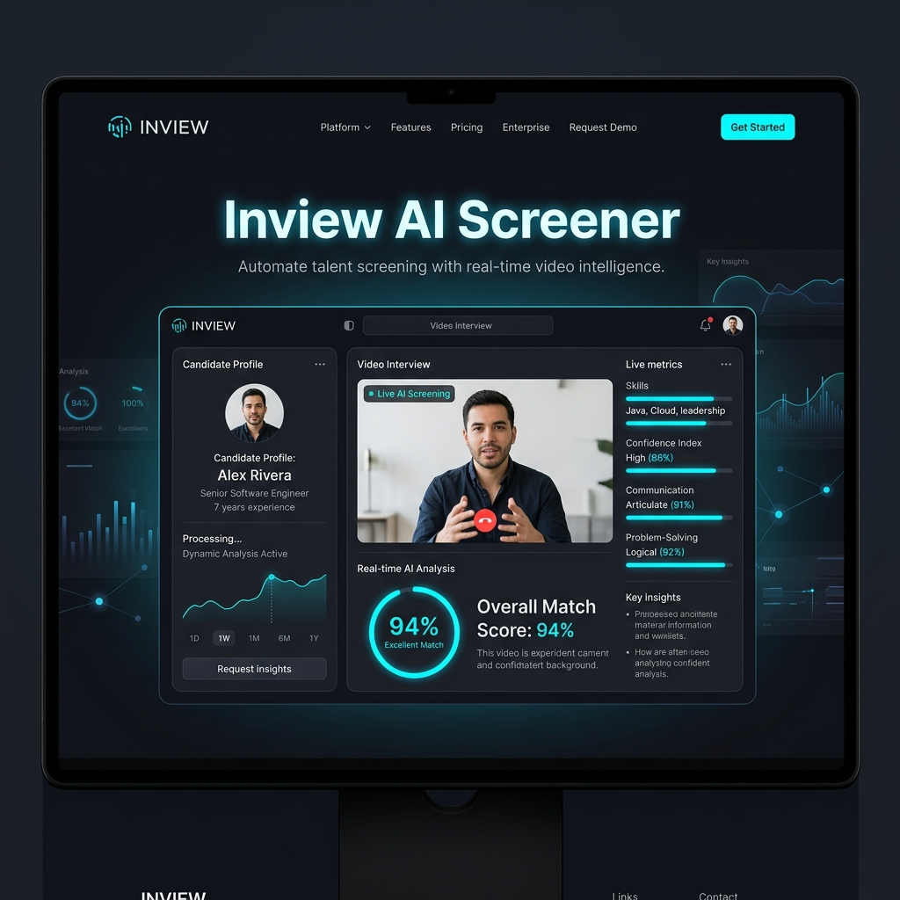

# <p align="center">🚀 Inview AI Screener v2.0</p>
<p align="center">
  
  
  
  
  
</p>

<p align="center">
  <b>Elevate Recruitment with Industrial-Grade AI Video Screening</b>
</p>

---

<p align="center">
  
</p>

## 🌟 What's New in v2.0?
The latest update transforms **Inview** from a prototype into a premium evaluation engine with a focus on visual excellence and deep analytical accuracy.

- 💎 **Premium Glassmorphism UI:** A stunning, futuristic dark theme with fluid animations and a high-end feel.
- 🌍 **Full Bilingual Core:** Native support for Arabic and English across the entire interface and AI report generation.
- 📊 **Advanced HR Dashboard:** Visual score cards, competency tables, and recommendation badges for instant hiring decisions.
- 🗣️ **Whisper-Large-V3 Integration:** Superior transcription accuracy for technical terms and multi-regional accents.
- 🧬 **Deep AI Analysis:** Multi-dimensional scoring across Technical, Communication, Problem Solving, and Behavioral skills.

---

## ✨ Key Features
- 🎥 **Intelligent Video Room:** Seamless recording with sub-second timestamp tracking for precise question-by-question analysis.
- 🧠 **LLM-Powered Evaluation:** Sophisticated candidate assessment logic that goes beyond keywords to understand semantic context.
- 🛡️ **Autonomous AI Proctoring:** Continuous Computer Vision monitoring (Face detection) to ensure session integrity.
- ⚡ **Auto-Slicing Data Pipeline:** Native FFMPEG integration for automated video segmentation based on actual user interaction.
- 🔊 **Neural TTS Voices:** Hyper-realistic interviewers speaking your choice of Arabic (Hamed) or English (Aria).

---

## 🛠️ The Tech Stack
| Tier | Technology |
| :--- | :--- |
| **Logic Framework** | Python 3.11+ |
| **User Interface** | Streamlit + Custom Glassmorphism CSS |
| **Interactive Assets** | Custom React/JS MediaRecorder Component |
| **Speech-to-Text** | OpenAI Whisper-Large-v3 (via HuggingFace) |
| **Analytical Brain** | Qwen 2.5 - 7B Instruct |
| **Visual Processing** | OpenCV (Computer Vision) |
| **Media Engineering** | FFMPEG (Native Multi-channel Processing) |

---

## 🚀 Quick Setup

### 1️⃣ Clone & Install
```bash
git clone https://github.com/MohamedAbdo-0/inview-ai-screener.git
cd inview-ai-screener
pip install -r requirements.txt
```

### 2️⃣ Configuration
Set your HuggingFace API key in a `.env` file:
```env
HF_TOKEN=your_token_here
```

### 3️⃣ Launch
```bash
python start.py
```

---

## 📖 Deep Documentation
Explore our technical breakdowns and architecture guides:
- 📄 [العربية - دليل النظام التفصيلي](Inview_AI_Screener_Documentation_AR.md)
- 📄 [English - Technical Documentation](Inview_AI_Screener_Documentation_EN.md)

---

<p align="center">
  Built with ❤️ for the next generation of HR excellence.
</p>
