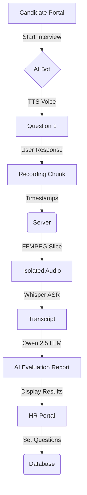

# <p align="center">🚀 Inview AI Screener</p>
<p align="center">
  
  
  
  
</p>

<p align="center">
  <b>The Future of Recruitment: AI-Powered Video Screening & Evaluation</b>
</p>

---

<p align="center">
  
</p>

## 🌟 Overview
**Inview AI Screener** is a state-of-the-art, End-to-End recruitment platform that automates the initial screening phase. By combining **Computer Vision**, **Large Language Models (LLMs)**, and **Speech Processing**, Inview acts as an intelligent HR interviewer that conducts, analyzes, and scores candidate interviews autonomously.

---

## ✨ Key Features
- 🎥 **Zoom-like Experience:** Fully integrated video recorder with real-time AI interaction.
- 🗣️ **Multilingual AI:** Seamlessly switch between Arabic (Edge-TTS Hamed) and English (Aria).
- 🧠 **Smart Evaluation:** Powered by **Qwen 2.5**, the AI provides deep semantic analysis, scoring, and hiring recommendations.
- 🛡️ **AI Proctoring:** Built-in face detection using OpenCV to prevent cheating and ensure identity verification.
- 📊 **HR Dashboard:** Comprehensive reports featuring candidate transcripts, video playback, and AI-generated insights.
- ⚡ **Instant Processing:** Automated video segmentation and processing via FFMPEG for zero-overlap analysis.

---

## 🛠️ The Tech Stack
| Component | Technology Used |
| :--- | :--- |
| **Frontend** | Streamlit + Custom HTML/JS Components |
| **Artificial Intelligence** | Qwen 2.5 (LLM) + Whisper-v3 (ASR) |
| **Speech Generation** | Edge-TTS (Neural Voices) |
| **Computer Vision** | OpenCV (Face Tracking) |
| **Data Processing** | FFMPEG (Media Slicing) |
| **Storage** | Local JSON State Store |

---

## 📐 System Architecture


---

## 🚀 Getting Started

### 1️⃣ Installation
Ensure you have Python 3.11+ and FFMPEG installed on your system.
```bash
git clone https://github.com/MohamedAbdo-0/inview-ai-screener.git
cd inview-ai-screener
pip install -r requirements.txt
```

### 2️⃣ Configuration
Create a `.env` file in the root directory and add your HuggingFace Token:
```env
HF_TOKEN=your_huggingface_token_here
```

### 3️⃣ Running the App
```bash
python start.py
```

---

## 📖 Documentation
Detailed technical documentation is available in both languages:
- 📄 [English Documentation](Inview_AI_Screener_Documentation_EN.md)
- 📄 [Arabic Documentation](Inview_AI_Screener_Documentation_AR.md)

---

<p align="center">
  Built with ❤️ for the future of talent acquisition.
</p>
